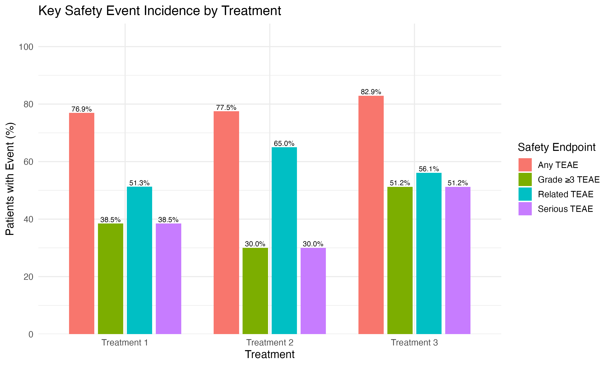
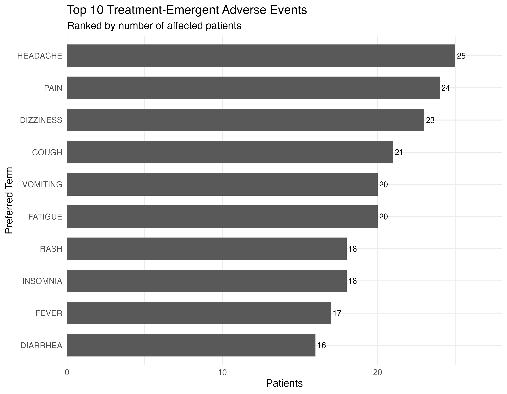

# Oncology Clinical Trial Analysis: SDTM to ADaM with `{admiral}`

## 1. Project Overview

This project demonstrates a reproducible clinical statistical-programming workflow for transforming oncology clinical-trial data from **SDTM** into analysis-ready **ADaM** datasets using R and the Pharmaverse ecosystem.

The analysis focuses on the derivation of:

- **ADSL** — Subject-Level Analysis Dataset
- **ADAE** — Adverse Events Analysis Dataset

The resulting datasets were used for descriptive safety analysis at the treatment and patient levels.

The dataset is **synthetic and educational** and therefore the results should not be interpreted as clinical evidence.

---

## 2. Study Data

The study contains:

- **120 subjects**
- **3 treatment groups**
- SDTM **DM** and **AE** domains
- 39 subjects in Treatment 1
- 40 subjects in Treatment 2
- 41 subjects in Treatment 3

The analysis used the actual treatment variable (`TRT01A`) to define the safety populations.

---

## 3. Programming Workflow

The project followed the workflow:

```text
SDTM DM + AE
      ↓
SDTM Quality Control
      ↓
ADSL + ADAE derivation
      ↓
ADaM Quality Control
      ↓
Patient-level safety analysis
      ↓
Treatment-level summaries
      ↓
Tables and figures
```

The main R packages used were:

- `{admiral}`
- `{tidyverse}`
- `{here}`

---

## 4. ADSL Derivation

ADSL was derived from the SDTM DM domain.

Key variables included:

- Subject identifiers
- Treatment assignment
- Actual treatment
- Demographics
- Reference treatment dates
- Treatment start and end dates
- Treatment duration
- Safety population flag

Treatment duration (`TRTDURD`) was derived using `{admiral}`.

The resulting ADSL contained **120 subjects**, with all subjects included in the simplified educational safety population.

The treatment distribution was:

| Treatment | N |
|---|---:|
| Treatment 1 | 39 |
| Treatment 2 | 40 |
| Treatment 3 | 41 |
| **Total** | **120** |

---

## 5. ADAE Derivation

ADAE was derived from the SDTM AE domain and supplemented with treatment information from ADSL.

The dataset contained **283 adverse-event records** from **103 subjects**.

Important analysis variables included:

- `TRTEMFL` — treatment-emergent AE flag
- `ASTDT` — analysis start date
- `AENDT` — analysis end date
- `ADURN` — AE duration
- `AOCCFL` — Grade ≥3 TEAE flag
- `AESERFL` — serious TEAE flag
- `ARELFL` — treatment-related TEAE flag

There were:

- **240 TEAE records**
- **43 non-TEAE records**

Patient-level summaries were used for incidence calculations so that a patient experiencing multiple events of the same type was counted only once for that endpoint.

---

## 6. Quality Control

QC was performed independently at several stages of the workflow.

Checks included:

- Subject-level uniqueness in DM and ADSL
- Cross-domain subject linkage
- Missing and inconsistent dates
- Treatment-date consistency
- Treatment-duration verification
- AE subject linkage
- AE sequence uniqueness
- Negative AE duration checks
- TEAE flag consistency
- Grade ≥3 flag consistency
- Safety-event patient counts

The derivation and analysis QC checks passed.

One date inconsistency was identified in the synthetic source data (`RFXSTDTC < RFSTDTC` for some subjects). Because this was a source-data issue, it was documented rather than silently corrected during programming.

---

## 7. Safety Analysis

The primary descriptive safety endpoints were:

1. Any treatment-emergent adverse event
2. Grade ≥3 TEAE
3. Serious TEAE
4. Treatment-related TEAE

Incidence was calculated using the number of subjects in the safety population as the denominator.

### Key Safety Results

| Endpoint | Treatment 1 | Treatment 2 | Treatment 3 |
|---|---:|---:|---:|
| Safety population | 39 | 40 | 41 |
| ≥1 TEAE | 30 (76.9%) | 31 (77.5%) | 34 (82.9%) |
| Grade ≥3 TEAE | 15 (38.5%) | 12 (30.0%) | 21 (51.2%) |
| Serious TEAE | 15 (38.5%) | 12 (30.0%) | 21 (51.2%) |
| Related TEAE | 20 (51.3%) | 26 (65.0%) | 23 (56.1%) |

Treatment 3 had the highest descriptive incidence of any TEAE and Grade ≥3/serious TEAEs.

Treatment 2 had the lowest incidence of Grade ≥3 and serious TEAEs, while having the highest proportion of treatment-related TEAEs.

These comparisons are descriptive only.

---

## 8. Most Frequent TEAEs

The most frequent TEAEs based on the number of unique patients were:

| Rank | Preferred Term | Patients |
|---:|---|---:|
| 1 | Headache | 25 |
| 2 | Pain | 24 |
| 3 | Dizziness | 23 |
| 4 | Cough | 21 |
| 5 | Fatigue | 20 |
| 6 | Vomiting | 20 |
| 7 | Insomnia | 18 |
| 8 | Rash | 18 |
| 9 | Fever | 17 |
| 10 | Diarrhea | 16 |

The analysis distinguishes **number of AE records** from **number of unique patients**. This is important because one patient may experience multiple adverse-event records.

---

## 9. Visual Analysis

### Key Safety Event Incidence

The treatment-level safety analysis shows the proportion of patients experiencing the main safety endpoints.



### Top 10 Treatment-Emergent Adverse Events

The second analysis summarizes the most frequent TEAEs by preferred term and treatment.



---

## 10. Interpretation

The synthetic dataset shows a relatively high incidence of TEAEs across all three treatment groups.

Treatment 3 has the highest descriptive overall TEAE incidence:

**82.9%**

and the highest Grade ≥3/serious TEAE incidence:

**51.2%**.

Treatment 2 has the lowest Grade ≥3 and serious TEAE incidence:

**30.0%**.

Treatment-related events are most frequent in Treatment 2:

**65.0%**.

However, these differences should not be interpreted as evidence that one treatment is clinically safer or less safe than another. The dataset is synthetic, the treatment groups are small, and the analysis is descriptive rather than confirmatory.

---

## 11. Limitations

This project has several intentional limitations:

- The clinical-trial dataset is synthetic.
- The analysis is descriptive.
- No formal hypothesis testing was performed.
- No confidence intervals or adjusted treatment comparisons were performed.
- The TEAE derivation uses a simplified educational definition.
- The safety population definition is simplified for demonstration.
- The analysis does not represent a complete regulatory submission package.

In a production clinical-trial environment, derivations would be based on the study-specific **SAP, SDTM/ADaM specifications, and programming conventions**.

---

## 12. Conclusion

This project demonstrates a reproducible **SDTM → ADaM → safety analysis** workflow using R and `{admiral}`.

The project successfully demonstrates:

- SDTM data import and QC
- ADSL derivation
- ADAE derivation
- Treatment and safety-variable derivation
- Patient-level safety summaries
- Treatment-level incidence calculations
- TEAE preferred-term analysis
- Automated QC checks
- Reproducible tables and figures

In the synthetic dataset, Treatment 3 showed the highest descriptive incidence of overall and severe safety events, while Treatment 2 showed the lowest incidence of Grade ≥3 and serious TEAEs.

The primary value of the project is therefore **not the clinical conclusion**, but the demonstration of a structured and reproducible clinical statistical-programming workflow from **SDTM data through ADaM derivation and safety analysis**.